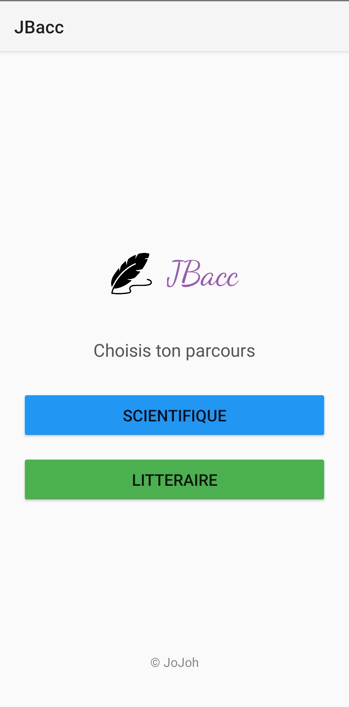
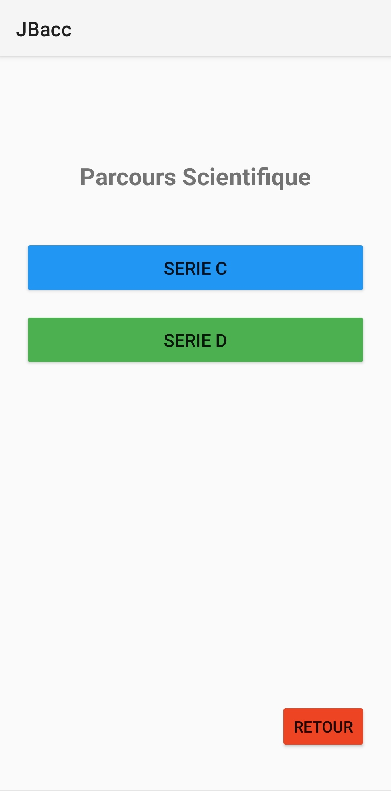
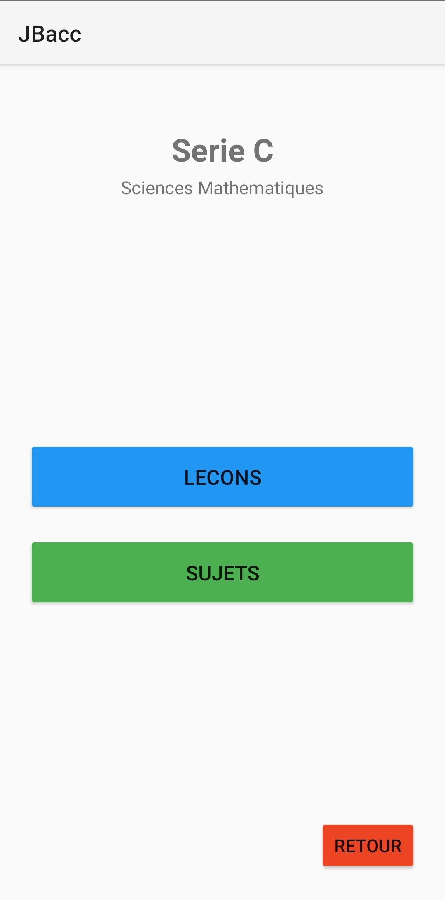
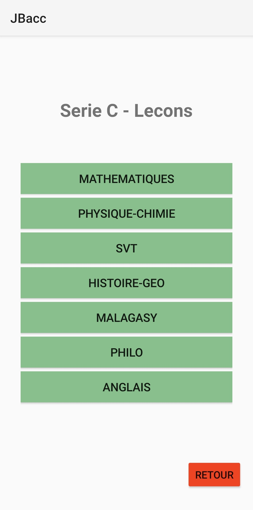
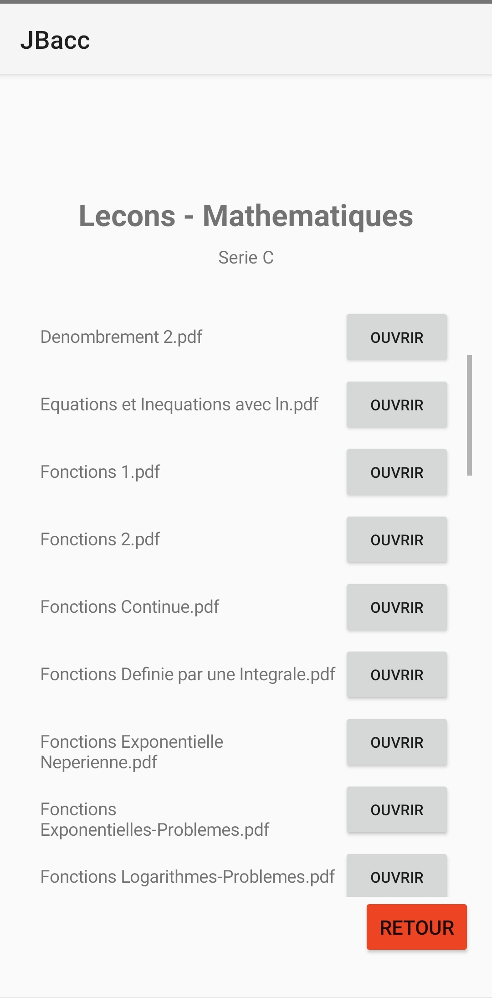
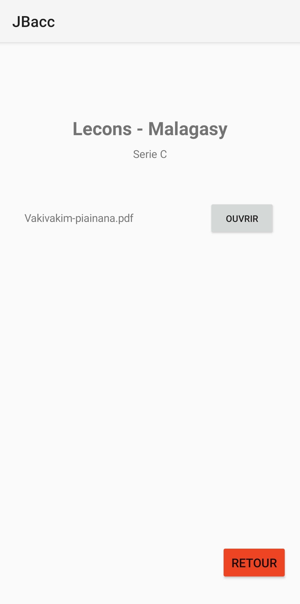
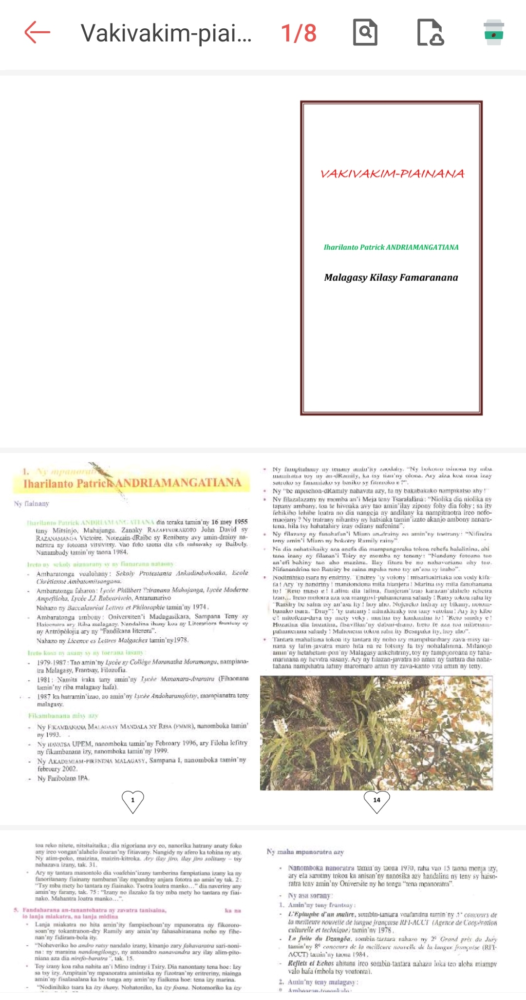

# 📚 JBacc - Révision Bac Madagascar

Application Android de révision pour les élèves de Terminale à Madagascar, développée avec **Kotlin**.

---

## 📱 Fonctionnalités

- 📚 **Leçons** : Accédez aux résumés de cours par matière
  - Mathématiques
  - Physique-Chimie
  - SVT
  - Histoire-Géographie
  - Philosophie
  - Malagasy
  - Anglais

- 📝 **Sujets d'examen** : Annales du Bac Madagascar (1999-2023)
  - Sujets officiels
  - Corrigés détaillés
  - Par matière et par série

- 🎯 **Séries disponibles** :
  - Série C
  - Série D
  - Série A1
  - Série A2

- 📄 **Visualisation** :
  - Ouvrez les PDF, images et présentations
  - Partage facile

---

## 📸 Captures d'écran

### Navigation dans l'application

| Écran | Description |
|-------|-------------|
|  | **Icône de l'application** - Logo JBacc |
|  | **Écran d'accueil** - Choix du parcours : Scientifique ou Littéraire |
|  | **Sélection des séries** - Choix entre Série C et Série D (Parcours Scientifique) |
|  | **Menu principal** - Accès aux Leçons et Sujets pour une série donnée |
|  | **Liste des matières** - Toutes les matières disponibles pour la série choisie |
|  | **Liste des documents** - Fichiers PDF disponibles par matière (ex: Mathématiques) |
|  | **Liste des documents** - Exemple avec Malagasy (Vakivakim-piainana) |
|  | **Visualisation PDF** - Affichage du document sélectionné |

---

### Aperçu rapide

  
  
  
   
  
  
  

---

## 🛠️ Prérequis

Avant de commencer, assurez-vous d'avoir installé :

| Outil | Version minimale | Téléchargement |
|-------|------------------|----------------|
| **Android Studio** | Hedgehog (2023.1.1) | [Télécharger](https://developer.android.com/studio) |
| **JDK** | 17 ou supérieur | [Télécharger](https://adoptium.net/) |
| **Git** | 2.30+ | [Télécharger](https://git-scm.com/) |

---

## 🛠️ Prérequis

Avant de commencer, assurez-vous d'avoir installé :

| Outil | Version minimale | Téléchargement |
|-------|------------------|----------------|
| **Android Studio** | Hedgehog (2023.1.1) | [Télécharger](https://developer.android.com/studio) |
| **JDK** | 17 ou supérieur | [Télécharger](https://adoptium.net/) |

---

## 📥 Installation
---
### 1️⃣ Cloner le projet

# Via HTTPS
git clone https://github.com/Johanes-mg/JBacc.git

# Accéder au dossier
cd JBacc

---
### 2️⃣ Ouvrir dans Android Studio

## Android Studio
Lancer le programme

Sélectionnez le dossier JNotes et faites vos modifs

## 📦 Génération de l'apk

### Nettoyer le projet et debug 

## Sur Windows (PowerShell ou CMD)
gradlew clean
gradlew assembleDebug

## Sur Linux
./gradlew clean
./gradlew assembleDebug

---
#### 📂 Où trouver l'APK Debug ?

~JBacc\app\build\outputs\apk\debug\app-debug.apk

---
### ⚠️ Note importante

Les sources des contenus pédagogiques ne sont pas produits par l'auteur du projet. Elles sont déjà citées dans les documents respectifs.

---

## 🙏 Remerciements

Les sources des leçons et sujets proviennent de :

- **CNTEMAD** 
- **Lycée Présentation de Marie**
- **Autres établissements scolaires** ayant contribué à la diffusion des ressources éducatives

Un grand merci à tous les enseignants et établissements qui partagent leurs connaissances pour la réussite des élèves.

---

## 🍀 Bonne chance pour le Bac !
## Auteur

Johanès Falitiana

## Licence

MIT

